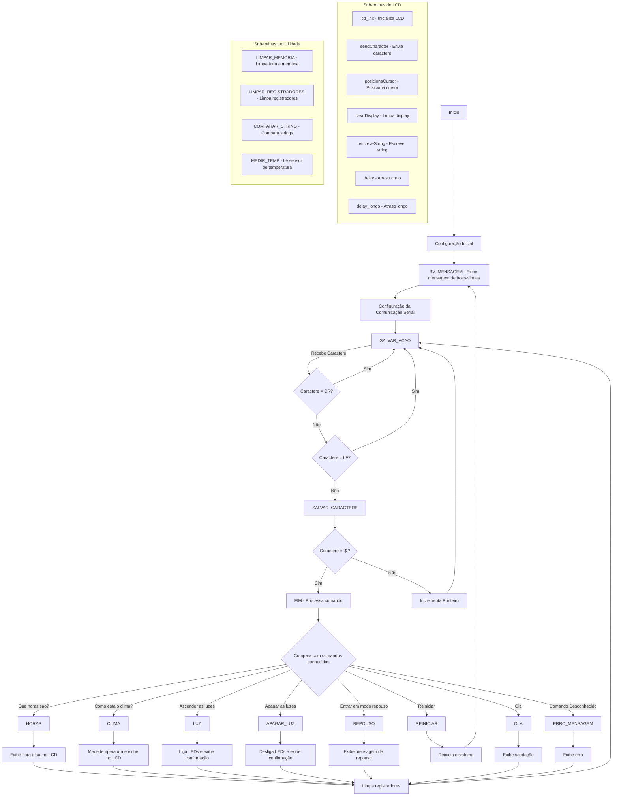

# Alexa

## 📝 Introdução

Este projeto visa desenvolver um programa similar a uma assistente virtual (tipo "Alexa") na plataforma EdSim51. O sistema recebe comandos via comunicação serial, armazena-os em memória e executa ações específicas baseadas no comando fornecido.

## 🚀 Funcionalidades do Sistema

### Inicialização

```assembly
RS equ P1.3 
EN equ P1.2

ORG 0000h
    ACALL BV_MENSAGEM
    LJMP INICIO
ORG 0100h

INICIO:
    MOV SCON, #01010000B ; Configurando SCON
    MOV PCON, #10000000B ; Ativa o SCON
    MOV TMOD, #20H       ; CT1 no modo 2
    MOV TH1, #243        ; Valor para a recarga
    MOV TL1, #243        ; Valor para a primeira contagem
    CLR ES               ; Desativa interrupção serial
    SETB EA              ; Se precisar das demais
    SETB TR1
    MOV R0, #30H
    MOV R1, #29H
```

**Explicação:** Este bloco inicializa os pinos e bits necessários para o funcionamento da comunicação serial, além de exibir uma mensagem de boas-vindas no display LCD.

### Captura de Comandos

```assembly
SALVAR_ACAO:
    JNB RI, SALVAR_ACAO
    CLR RI
    MOV A, SBUF
    ; Verifica se são caracteres de validação do ASCII como enters e /r
    CJNE A, #0DH, VERIFICA_LF
    SJMP SALVAR_ACAO    
    
VERIFICA_LF:
    ; Verifica se é LF (0A)
    CJNE A, #0AH, SALVAR_CARACTERE
    SJMP SALVAR_ACAO    ; Ignora LF e volta para esperar próximo caractere

SALVAR_CARACTERE:
    MOV @R0, A
    CJNE A, #'$', CONTINUAR
    SJMP FIM

CONTINUAR:
    INC R0
    SJMP SALVAR_ACAO
```

**Explicação:** Com as portas e pinos inicializados, o programa começa a "escutar" a comunicação serial. Ao receber uma mensagem, cada caractere é salvo na memória até encontrar o caractere de controle ('$').

### Processamento de Comandos

```assembly
FIM:
    MOV R0, #30H

    MOV DPTR, #msg_horas
    ACALL COMPARAR_STRING
    JZ HORAS

    MOV DPTR, #msg_ligar_luz
    ACALL COMPARAR_STRING
    JZ LUZ

    MOV DPTR, #msg_apagar_luz
    ACALL COMPARAR_STRING
    JZ APAGAR_LUZ

    MOV DPTR, #msg_repouso_pergunta
    ACALL COMPARAR_STRING
    JZ FLAG_REPOUSO

    MOV DPTR, #msg_reiniciar3
    ACALL COMPARAR_STRING
    JZ FLAG_REINICIAR

    MOV DPTR, #msg_ola3
    ACALL COMPARAR_STRING
    JZ FLAG_OLA

    MOV DPTR, #msg_clima
    ACALL COMPARAR_STRING
    JZ FLAG_CLIMA

    ACALL ERRO_MENSAGEM
    LJMP SALVAR_ACAO

FLAG_OLA:
    LJMP OLA
FLAG_CLIMA:
    LJMP CLIMA
FLAG_REINICIAR:
    LJMP REINICIAR
FLAG_REPOUSO:
    LJMP REPOUSO
```

**Explicação:** Após receber a string completa, o sistema compara o comando recebido com as ações disponíveis. Se o comando for reconhecido, chama a subrotina responsável por executar a ação correspondente; caso contrário, exibe uma mensagem de erro.

## 📋 Subrotinas de Comando

### Exibição de Horas

```assembly
HORAS:
    ACALL lcd_init
    ACALL clearDisplay
    ACALL delay_longo
    MOV A, #03H
    ACALL posicionaCursor
    MOV DPTR, #msg_hora
    ACALL escreveString
    MOV A, #46H
    ACALL posicionaCursor
    MOV DPTR, #msg_hora2
    ACALL escreveString
    MOV R0, #30H
    ACALL LIMPAR_REGISTRADORES
    LJMP SALVAR_ACAO
```

**Explicação:** A subrotina HORAS exibe no display LCD uma mensagem contendo o horário atual.

### Controle de Iluminação - Ligar

```assembly
LUZ:
    MOV P0, #00000000B
    ACALL lcd_init
    ACALL clearDisplay
    ACALL delay_longo
    MOV A, #02H
    ACALL posicionaCursor
    MOV DPTR, #msg_ligar
    ACALL escreveString
    MOV A, #42H
    ACALL posicionaCursor
    MOV DPTR, #msg_ok
    ACALL escreveString
    MOV R0, #30H
    ACALL LIMPAR_REGISTRADORES
    LJMP SALVAR_ACAO
```

**Explicação:** Esta subrotina ativa os LEDs do EdSim51 (P0 = 0) e exibe no display uma mensagem confirmando que as luzes foram acesas.

### Controle de Iluminação - Desligar

```assembly
APAGAR_LUZ:
    MOV P0, #11111111B
    ACALL lcd_init
    ACALL clearDisplay
    ACALL delay_longo
    MOV A, #00H
    ACALL posicionaCursor
    MOV DPTR, #msg_desligar
    ACALL escreveString
    MOV R0, #30H
    ACALL LIMPAR_REGISTRADORES
    LJMP SALVAR_ACAO
```

**Explicação:** Esta subrotina desativa os LEDs (P0 = 1) e exibe uma mensagem confirmando que as luzes foram apagadas.

### Modo Repouso

```assembly
REPOUSO:
    ACALL lcd_init
    ACALL clearDisplay
    ACALL delay_longo
    MOV A, #01H
    ACALL posicionaCursor
    MOV DPTR, #msg_dormir
    ACALL escreveString
    MOV A, #41H
    ACALL posicionaCursor
    MOV DPTR, #msg_dormir2
    ACALL escreveString
    ACALL delay_longo
    ACALL clearDisplay
    ACALL delay_longo
    MOV A, #01H
    ACALL posicionaCursor
    MOV DPTR, #msg_dormir3
    ACALL escreveString
    MOV R0, #30H
    ACALL LIMPAR_REGISTRADORES
    LJMP SALVAR_ACAO
```

**Explicação:** Esta subrotina simula a entrada no modo de repouso, exibindo uma sequência de mensagens no LCD.

### Reinicialização do Sistema

```assembly
REINICIAR:
    ACALL lcd_init
    ACALL clearDisplay
    ACALL delay_longo
    MOV A, #01H
    ACALL posicionaCursor
    MOV DPTR, #msg_reiniciar
    ACALL escreveString
    MOV A, #41H
    ACALL posicionaCursor
    MOV DPTR, #msg_reiniciar2
    ACALL escreveString
    ACALL delay_longo
    ACALL LIMPAR_MEMORIA
    ACALL delay_longo
    ACALL clearDisplay
    ACALL delay_longo
    ACALL BV_MENSAGEM
    MOV R0, #30H
    LJMP SALVAR_ACAO
```

**Explicação:** Esta subrotina reinicia o sistema, limpando a memória e os registradores, além de reexibir a mensagem de boas-vindas.

### Interação Básica - Olá

```assembly
OLA:
    ACALL lcd_init
    ACALL clearDisplay
    ACALL delay_longo
    MOV A, #01H
    ACALL posicionaCursor
    MOV DPTR, #msg_ola
    ACALL escreveString
    MOV A, #41H
    ACALL posicionaCursor
    MOV DPTR, #msg_ola2
    ACALL escreveString
    MOV R0, #30H
    ACALL LIMPAR_REGISTRADORES
    LJMP SALVAR_ACAO
```

**Explicação:** Esta subrotina responde ao usuário com uma saudação, tornando a interface mais interativa.

### Informação de Clima/Temperatura

```assembly
CLIMA:
    ACALL lcd_init
    ACALL clearDisplay
    ACALL MEDIR_TEMP 
    ACALL delay_longo
    MOV A, #02H
    ACALL posicionaCursor
    MOV DPTR, #msg_temp
    ACALL escreveString
    ACALL delay_longo

    ; Converte e exibe a temperatura
    MOV A, R4            ; A = temperatura (0–255)
    MOV B, #100          ; Dividir por 100 para obter as centenas
    DIV AB               ; A = centenas, B = resto (dezenas e unidades)
    ADD A, #30h          ; Converte centenas para ASCII
    MOV R6, A            ; Armazena a centena (ASCII)

    MOV A, B              ; A = resto (dezenas e unidades)
    MOV B, #10            ; Dividir por 10 para obter as dezenas
    DIV AB                ; A = dezenas, B = unidades
    ADD A, #30h           ; Converte dezenas para ASCII
    MOV R7, A             ; Armazena a dezena (ASCII)

    MOV A, B              ; A = unidades
    ADD A, #30h           ; Converte unidades para ASCII
    MOV R5, A             ; Armazena a unidade (ASCII)

    ; Exibe centenas
    MOV A, #0C4h          ; Posição no LCD: linha 2, coluna 4
    ACALL posicionaCursor
    MOV A, R6
    ACALL sendCharacter

    ; Exibe dezenas
    MOV A, #0C5h          ; Posição no LCD: linha 2, coluna 5
    ACALL posicionaCursor
    MOV A, R7
    ACALL sendCharacter

    ; Exibe unidades
    MOV A, #0C6h          ; Posição no LCD: linha 2, coluna 6
    ACALL posicionaCursor
    MOV A, R5
    ACALL sendCharacter

    ACALL delay_longo
    
    MOV A, #48H
    ACALL posicionaCursor
    MOV DPTR, #msg_temp2
    ACALL escreveString
    MOV R0, #30H
    ACALL LIMPAR_REGISTRADORES
    LJMP SALVAR_ACAO
```

**Explicação:** Esta subrotina lê o valor do componente ADC do EdSim51, converte o valor em volts para temperatura (multiplicando por 2), separa os dígitos do número e os exibe no LCD.

### Tratamento de Erro - Comando Inválido

```assembly
ERRO_MENSAGEM:
    ACALL lcd_init
    ACALL clearDisplay
    ACALL delay_longo
    MOV A, #02H
    ACALL posicionaCursor
    MOV DPTR, #msg_erro
    ACALL escreveString
    MOV A, #41H
    ACALL posicionaCursor
    MOV DPTR, #msg_erro2
    ACALL escreveString
    MOV R0, #30H
    ACALL LIMPAR_REGISTRADORES
    RET
```

**Explicação:** Esta subrotina exibe uma mensagem de erro no display quando o comando fornecido não corresponde a nenhuma das ações disponíveis.

## 🤖 Resumo de Funcionamento

O sistema opera seguindo estas etapas:

1. Recebe um comando do usuário via comunicação serial
2. Processa e compara o comando com as ações disponíveis
3. Se o comando existir, executa a subrotina correspondente
4. Caso contrário, exibe uma mensagem de erro

## 📋 Lista de Comandos Disponíveis

| Comando | Função |
|---------|--------|
| **Que horas sao?** | Exibe o horário atual |
| **Como esta o clima?** | Calcula e exibe a temperatura |
| **Ascender as luzes** | Ativa os LEDs |
| **Apagar as luzes** | Desativa os LEDs |
| **Entrar em modo repouso** | Ativa o modo de repouso |
| **Reiniciar** | Reinicia todo o sistema |
| **Ola** | Responde com uma saudação |

---
## 🧬 Experimentos


---

## 📈 Diagrama do projeto


